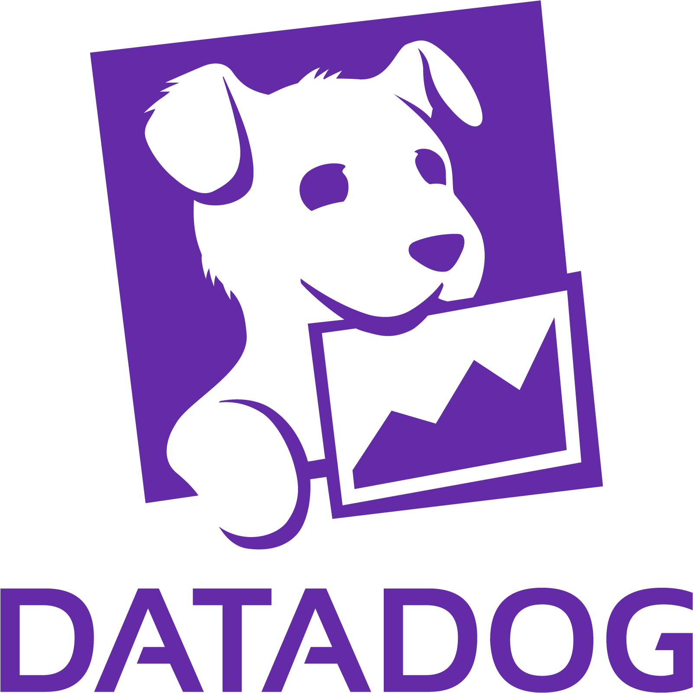
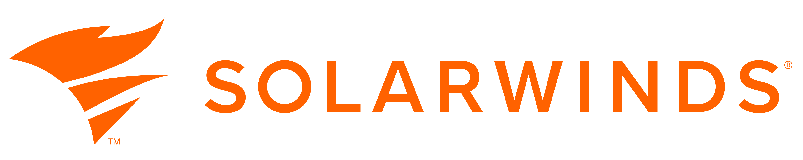
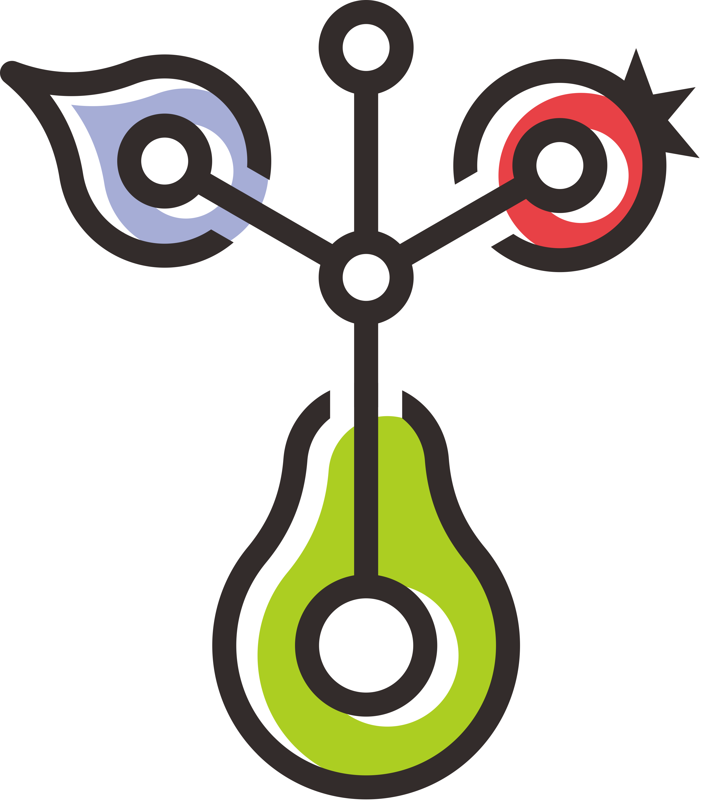
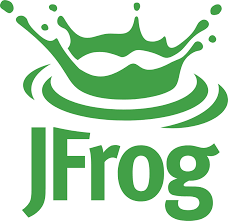

# in-toto/friends

This repository is a place to record integrations (ongoing and complete) and adoptions of in-toto. This information can be useful to sharing the nuances of specific integrations or adoptions which can help newer adopters in the future.

We welcome adopters to add to the list here by creating a directory with a README file describing how they use in-toto. The directory can contain any other artifacts necessary to detail the in-toto integration.

## Project Adopters
This section lists organizations or individuals who have adopted the project and are using it in their workflows or systems. These adopters contribute to the project's ecosystem and showcase its real-world usage across various domains.

| Adopter Name    | logo | Description |
|-----------------|------|-------------|
| Datadog         ||Datadog uses in-toto to secure its agent integrations as they move through the company's CI/CD system. |
| Lockheed Martin ||Lockheed Martin is one of the world's largest aerospace and defense companies, primarily known for manufacturing military aircraft like the F-35 Lightning II and F-22 Raptor fighter jets. |
| OpenVEX         ||OpenVEX documents are designed to be self-sustaining, but the specification is designed to benefit from the in-toto attestation format completing VEX statements with data outside of the OpenVEX predicate. |
| Palantir        | | Palantir uses in-toto to protect software integrity at enterprise scale with signed attestations, multi-ecosystem build support, offline-capable distribution, and layered verification. |
| SLSA            ||Supply chain Levels for Software Artifacts, or SLSA, is a framework that provides a series of requirements and controls. |
| SolarWinds      ||SolarWinds is an American company that provides information technology services and software to other companies and government agencies. |

## Project Integrations
This section lists software systems, services, or platforms that integrate with the project to provide additional functionality, interoperability, or compatibility. These integrations enhance the project's capabilities and extend its usefulness across various ecosystems.

| Integration Name | Logo | Description |
|------------------|------|-------------|
| Conforma         | | Conforma is a policy engine that leverages in-toto attestations to securely verify software supply chain artifacts. It uses these attestations, which are cryptographic records of a build process, to enforce compliance with security policies. |
| GitHub           | | GitHub is a developer platform popular across enterprises and open source. GitHub artifact attestations supports SLSA build provenance and SBOM in-toto predicate types. |
| GitLab           | | GitLab is a popular Git server that also provides CI/CD integrations. |
| Grafeas          || Grafeas is an open source metadata API that is used to store metadata relevant to software supply chains. Grafeas includes support for in-toto link metadata. |
| GUAC             || GUAC has the ability to ingest and parse SLSA and other in-toto ITE6 attestations (either wrapped in DSSE or standalone). |
| Hoppr            || Hoppr leverages the in-toto python package to generate in-toto layout files based on a hoppr transfer configuration. |
| Jenkins          || The in-toto team maintains a plugin for Jenkins that can be used to generate in-toto metadata pertaining to a particular build or "job". |
| JFrog          || JFrog Artifact ensures the integrity of evidence predicates and payloads using in-toto |
| rebuilderd       || Rebuilderd is a build system project part of Reproducible Builds. When the result of a rebuild is positive, i.e., the build process is found to be reproducible, rebuilderd generates an in-toto link recording this result. |
| [Shipmoor](shipmoor/README.md) || Shipmoor is a local, vendor-neutral verification layer for AI-agent-written code. Its Claim Check feature wraps build, test, scan, and review evidence in in-toto attestations and ships the verdict as a SLSA-shaped Verification Summary Attestation (VSA) with a self-digest, checking reruns byte-for-byte rather than trusting the exit code. |
| Sigstore         || In-toto and Sigstore are complementary in their efforts, and Sigstore integrates in-toto in a number of ways. Sigstore's keyless signing can be used to sign in-toto metadata, as demonstrated by Cosign's SLSA Provenance generation. |
| Tekton Chains    | | Tekton Chains is a component for Tekton that adds software supply chain security. Chains observes all "TaskRuns" or jobs that are executed, and generates an in-toto attestation. |
| TestifySec       || TestifySec is a software supply chain security company that has created two open source projects that leverage in-toto. Witness and Archivista. |

## Project Producers
This section lists how producers of attestations record and store attestations. This information is useful for consumers of in-toto attestations to find attestations for subsequent use. Additionally, producers of in-toto attestations can use the list to follow common patterns for storing new attestations. Each project is classified by the following schema.

### Classification

Each storage source is classified by the following categories:

- *Type Storage:* If the storage location is a:
    - Repository
    - Image
    - Package registry
    - Database
    - Aggregators
- *Besides Artifact:* If the attestations are stored alongside the artifact they attest to or are stored elsewhere. 
- *Format Storing:* What attestation format is used to store the attestation. Known common formats are the following:
   - [dsse](https://github.com/secure-systems-lab/dsse) 
   - [Sigstore Bundle](https://docs.sigstore.dev/about/bundle/)
   - [Cosign Bundle](https://github.com/sigstore/cosign/blob/main/specs/BUNDLE_SPEC.md)
   - [Attestation Bundle](https://github.com/in-toto/attestation/blob/main/spec/v1/bundle.md)
   - Rows in an SQL table.
- *Visibility:* If the data storage mechanism data allows to store public or private attestations.

### Summary

| Location | Alongside artifact? | Storage Format | Visibility |
|----------|---------------------|--------|-----------|
| Repository-Git Commits | True | Any (Suggested [Attestation Bundle](https://github.com/in-toto/attestation/blob/main/spec/v1/bundle.md)) | Public, Private |
| Repository-Git Repository | False | Any | Public, Private |
| Repository-Immutable Releases | True | [Sigstore Bundle](https://docs.sigstore.dev/about/bundle/) | Public, Private |
| Repository-Linked Artifact | True | Any | Public, Private |
| Repository-Release Files | True | Any | Public, Private |
| Images-Attestation Manifest | Either | [Attestation Blob](https://github.com/moby/buildkit/blob/master/docs/attestations/attestation-storage.md#attestation-blob) | Public, Private |
| Images-Manifest Referrers | Either | Any | Public, Private |
| Package-Registry-Homebrew | Planned | Planned | Public |
| Package-Registry-Maven | Planned | Planned | Public |
| Package-Registry-npm | True | [Sigstore Bundle](https://docs.sigstore.dev/about/bundle/) | Public |
| Package-Registry-crates.io | Planned | Planned | Public |
| Package-Registry-NuGet | Planned | Planned | Public |
| Package-Registry-PyPI | True | [Sigstore Bundle](https://docs.sigstore.dev/about/bundle/) | Public |
| Package-Registry-Ruby | Unsure | Unsure | Public |
| Database-Artifact Attestations | False | [Sigstore Bundle](https://docs.sigstore.dev/about/bundle/) | Public, Private |
| Database-Archivista | False | [dsse](https://github.com/secure-systems-lab/dsse) | Private |
| Database-OSS Rebuild | False | [dsse](https://github.com/secure-systems-lab/dsse) | Public |
| Database-Sigstore Rekor | False | [dsse](https://github.com/secure-systems-lab/dsse), [intoto](https://github.com/sigstore/rekor/blob/main/pkg/types/intoto/README.mdn), [hashedrekord](https://github.com/sigstore/rekor/blob/main/pkg/types/hashedrekord/v0.0.1/hashedrekord_v0_0_1_schema.json) | Public, Private |
| Aggregator-BigQuery | False | Rows | Public |
| Aggregator-deps.dev | True | References | Public |
| Aggregator-ecosyste.ms | Planned | Planned | Public |

## Credit

The `friends` idea was borrowed from other communities in the space like Sigstore and tektoncd.
